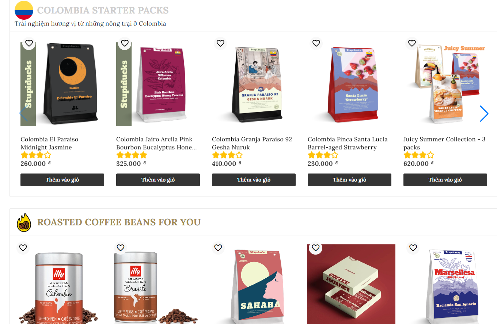

# Cà phê Filtro

## Overview

Xây dựng trang web bán cà phê bằng Angular

## Mục lục
1. [Chức năng](#chức-năng)
2. [Công nghệ](#công-nghệ)
3. [Yêu cầu](#yêu-cầu)
4. [Cài đặt](#cài-đặt)
5. [Sử dụng](#sử-dụng)

## Chức năng

1. Xem chi tiết [ở đây](https://github.com/Arkadian404/filtro_jwt_backend)
2. Một vài hình ảnh demo
  - Trang chủ
    
  - Danh sách các sản phẩm
    
  - Chi tiết sản phẩm
    
    
  - Giỏ hàng
    
  - Đặt hàng
    
  - Lịch sử đơn hàng
    
  - Chi tiết đơn hàng
    
  - Admin - thống kê
    
  - Admin - quản lý sản phẩm
    

## Công nghệ

1. Framework: Angular
2. Ngôn ngữ: TypeScript
3. Khác: HTML, CSS, Bootstrap, RxJS

## Yêu cầu

1. NodeJS 18+
2. Angular CLI 16

## Cài đặt

1. Clone project về máy
```bash
git clone https://github.com/Arkadian404/filtro_jwt
 ```
2. Mở project bằng IDE(VSCode, WebStorm, ...) hoặc cmd
3. Cài đặt các thư viện cần thiết được liệt kê trong file `package.json`
```bash
npm install
```
4. Chạy project
```bash
ng serve
```

## Sử dụng
1. Khi chạy project thành công, mặc định port là 4200, truy cập vào đường dẫn http://localhost:4200/ và phần `admin` http://localhost:4200/admin (name: admin, password: 1)
2. Có thể tùy chỉnh url API trong file `environements/environment.ts` hoặc thông qua file `proxy.conf.json` vì lệnh `ng serve` đã được cấu hình chạy cùng với proxy trong file `angular.json` (có thể bỏ qua proxy)
3. Phần gợi ý sản phẩm và chatbot (có thể bỏ qua) xem [ở đây](https://github.com/Arkadian404/recommender_system_api) 
